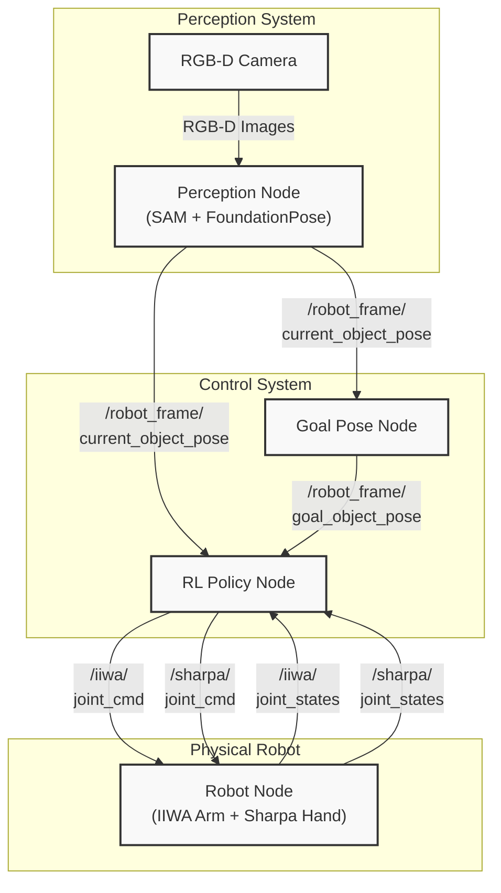
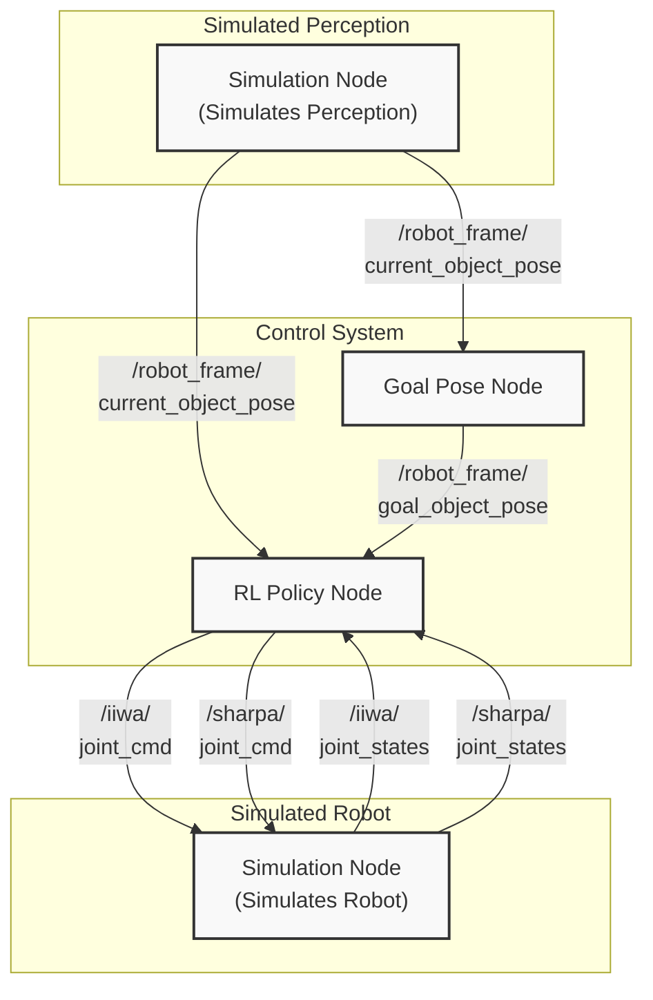
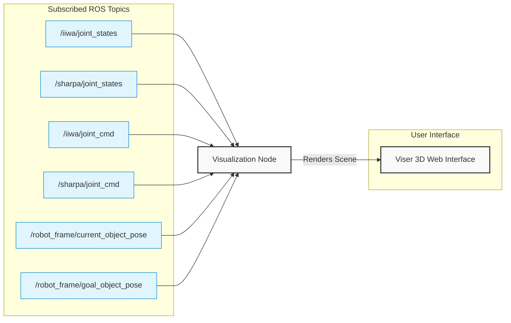

# Deployment

Policy deployment in the real world (Sim2Real) and in simulation with a real-world-like node setup (Sim2Sim). The deployment nodes currently run against the Isaac Gym environment (see [isaacgym_installation.md](isaacgym_installation.md)).

## Sim2Real

For Sim2Real policy deployment, we need to run the following nodes:

1. RL Policy Node: Takes in observations, runs policy to get raw actions, converts to joint position targets, and publishes these targets.
2. Goal Pose Node: Stores a sequence of goal poses, takes in object pose, updates current goal pose if dist(goal, object) < threshold, and publishes the current goal pose.
3. Perception Node: Takes in RGB-D images, uses SAM and FoundationPose to get object pose, and publishes these poses. See the [FoundationPose fork](https://github.com/kushal2000/FoundationPose) for setup and usage.
4. Robot Node: Sends joint position targets to robot and publishes joint states.

(1) and (2) are in this repo. (3) is in the [FoundationPose fork](https://github.com/kushal2000/FoundationPose). (4) is not in this repo.

The following is the Sim2Real deployment flowchart:



## Sim2Sim

Before testing the policy in the real world, we can test it in simulation using a similar setup to the real world. For Sim2Sim policy deployment, we need to run the following nodes:

1. RL Policy Node: (same as above)
2. Goal Pose Node: (same as above)
3. Simulation Node: Takes in joint position targets, runs the simulation environment and publishes the simulation state (robot state and object pose). Replaces the robot node and perception node.

(1) and (2) are in this repo. (3) is handled by the Simulation Node.

The following is the Sim2Sim deployment flowchart (the Simulation Node at the top and bottom are the same node, but separated in the diagram for clarity/symmetry with the Sim2Real deployment flowchart):



## Visualization Node

We also use a Visualization Node that subscribes to relevant ROS topics and renders a 3D scene using Viser. This is very useful for debugging and visualization. This node only subscribes and does not publish any topics (read-only).



## How To Run

### Sim2Real

**Prerequisites:**
- **Hardware**: IIWA arm, Sharpa hand, ZED stereo camera
- **FoundationPose**: Clone and install the [FoundationPose fork](https://github.com/kushal2000/FoundationPose) in a **separate environment** (`foundationpose`). Follow its README for installation, model weight download, and ROS setup.
- **Calibration**: A camera-to-robot transform `T_RC` specific to your setup. An example is provided at `FoundationPose/calibration/T_RC_example.txt`.
- **Object mesh**: `.obj` file (in meters) for the object being manipulated. See [data_collection_and_processing.md](data_collection_and_processing.md) for mesh extraction with SAM 2 + SAM 3D.

Run the following nodes in separate terminals:

```bash
# Terminal 1: Arm (ROS)
roslaunch iiwa_control joint_position_control.launch
```

```bash
# Terminal 2: Hand
source .venv/bin/activate
python deployment/sharpa_node.py
```

```bash
# Terminal 3: Perception (separate environment)
# Activate the FoundationPose environment (see FoundationPose README)
cd /path/to/FoundationPose
python live_tracking_with_ros.py \
    --mesh_path <mesh.obj> \
    --calibration calibration/T_RC_example.txt
```

### Sim2Sim

If running in simulation, run the following:

```
python deployment/isaac/isaac_env_node.py \
--object_category hammer \
--object_name claw_hammer \
--task_name swing_down
```

### Sim2Sim (No Physics)

To test this pipeline without running an actual physics simulation, you can replace the Simulation Node with (1) a fake robot node that simply interpolates to the joint position targets and (2) a fake perception node that simply publishes a fixed object pose:

```
python deployment/fake/fake_robot_node.py
```

```
python deployment/fake/fake_perception_node.py
```

### Before Running Policy

First, start the Visualization Node:

```
python deployment/visualization_node.py \
--object_name claw_hammer
```

Next, home the robot:

```
python deployment/home_robot.py
```

## Running the Policy

To run the Goal Pose Node, run:

```
python deployment/goal_pose_node.py \
--object_category hammer \
--object_name claw_hammer \
--task_name swing_down
```

To run the RL Policy Node, run:

```
python deployment/rl_policy_node.py \
--policy_path pretrained_policy \
--object_name claw_hammer
```

### Running Open-loop Replay of Joint Position Trajectory

To run an open-loop replay of a joint position trajectory:

```
python deployment/replay_trajectory.py \
--file_path <file_path>
```

For example:

```
python deployment/replay_trajectory.py \
--file_path recorded_robot_inputs/2026-02-17_testing/2026-02-17_02-33-12_model_arm0.1_claw_hammer.npz
```

## Run Baselines

See [baselines.md](baselines.md) for more details.

## Visualize Recorded Policy Data

When `rl_policy_node.py` is running, it will record observation data and save this to a file upon exiting. You can visualize this data using the following script:

```
python recorded_data/visualize.py \
--file_path <file_path>
```

For example:

```
python recorded_data/visualize.py \
--file_path recorded_robot_inputs/2026-02-17_testing/2026-02-17_02-33-12_model_arm0.1_claw_hammer.npz
```

https://github.com/user-attachments/assets/b27f293c-2f04-4057-b369-6117ba05ce4f
